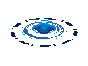

  

    <h1>
    
  </h1>
  

<h3 align="center">A passionate fullstack developer from Sri Lanka</h3>
 

  
  🔭 I’m currently Undergraduate at University of Westminster
  
  🌱 I’m currently learning **Generative AI**
  
  📫 How to reach me **nemsararanaba14@gmail.com**
  
  ⚡ Fun fact **call me as nema**
  

 

 
  
  
  

   
  
  

 
<h2 align="center">⚒️ Languages-Frameworks-Tools ⚒️</h2>
 

    
     

 

  <h2>🐍 My Contributions 🐍</h2>
   
  
  
     

<h2 align="center">⚡ Stats ⚡</h2>
 

  <table border="0">
    <tr>
      <td>
        
      </td>
      <td>
        
      </td>
    </tr>
  </table>

   

  <table border="0">
    <tr>
      <td>
        
      </td>
      <td>
        
      </td>
    </tr>
  </table>

  <h2>🏆 Trophies 🏆</h2>
   

  

  
  
     

 
